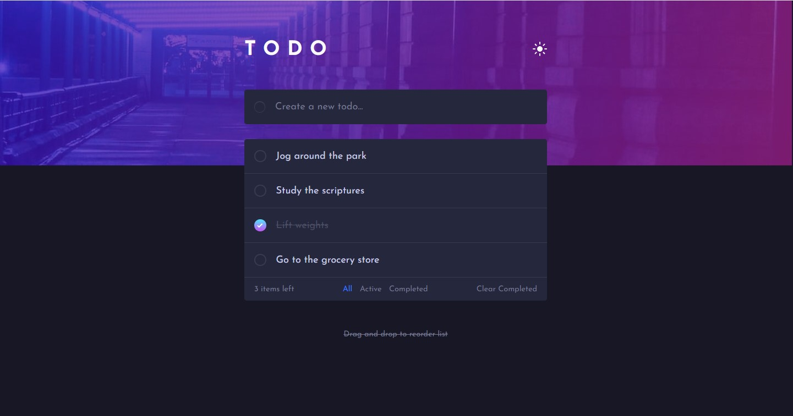

# Frontend Mentor - Todo app solution

This is a solution to the [Todo app challenge on Frontend Mentor](https://www.frontendmentor.io/challenges/todo-app-Su1_KokOW). Frontend Mentor challenges help you improve your coding skills by building realistic projects.

## Table of contents

- [Overview](#overview)
  - [The challenge](#the-challenge)
  - [Screenshot](#screenshot)
  - [Links](#links)
- [My process](#my-process)
  - [Built with](#built-with)
  - [What I learned](#what-i-learned)
  - [Continued development](#continued-development)

## Overview

### The challenge

Users should be able to:

- View the optimal layout for the app depending on their device's screen size
- See hover states for all interactive elements on the page
- Add new todos to the list
- Mark todos as complete
- Delete todos from the list
- Filter by all/active/complete todos
- Clear all completed todos
- Toggle light and dark mode
- **Bonus**: Drag and drop to reorder items on the list

### Screenshot

### Links

- Solution URL: [https://github.com/travdog95/todo-app-main](https://github.com/travdog95/todo-app-main)
- Live Site URL: [https://travdog95.github.io/todo-app-main/](https://travdog95.github.io/todo-app-main/)

## My process

### Built with

- HTML5
- JavaScript
- CSS custom properties
- Flexbox
- CSS Grid
- Media Queries

### What I learned

I learned more about SVG, but I still need to learn more. I couldn't figure out a good way to dynamically resize an SVG. I wanted to make the "X" icon on smaller on the mobile layout, but it look strange.

### Continued development

I made a feeble attempt to implement drag and drop using vanilla JS. However, using an JS library or framework would be much easier.
